# Automate static website deployments to S3 using CodePipelie

This lab walks you through the steps to host and deploy [static websites to S3](https://docs.aws.amazon.com/AmazonS3/latest/dev/WebsiteHosting.html) using CodePipeline. A static website comprises of individual webpages including static content. They might also contain client-side scripts. [AWS CodePipeline](https://docs.aws.amazon.com/AmazonS3/latest/dev/WebsiteHosting.html) is a continuous delivery service you can use to model, visualize, and automate the steps required to release your software. 

This lab is set to Level 100, hence participants are not required to have any specific knowledge of AWS. The lab will take ~10-15 minutes to complete.


## Let's get started
You will first setup a bucket to host static website. Then you will create a deployment pipeline to deploy files, such as static website content or artifacts from your build process, to Amazon S3.

Before we begin, we will need to login into AWS Cloud9. Cloud9 is a cloud-based integrated development environment (IDE) that lets you write and run code with just a browser. All code required to setup the lab is prepared, participants are only required to run the scripts in Cloud9.

To access Cloud9 search for `Cloud9` in the AWS Console and click on Cloud9.


Under `Your environments`, open the **Website deployment using Codepipeline (Level 100)** Cloud9 instance by clicking on **Open IDE**

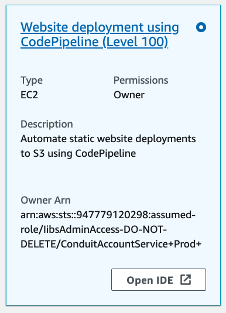


### Step 1: Setup S3 bucket to host your website 

To host a static website, you configure an Amazon S3 bucket for website hosting, and then upload your website content to the bucket. This bucket must have public read access. It is intentional that everyone in the world will have **read** access to this bucket. The website is then available at the AWS Region-specific website endpoint of the bucket.

1. Run the following command in Cloud9 terminal to create S3 bucket and set appropriate permission to host a website.

```bash
aws cloudformation deploy --template-file /home/ec2-user/environment/awss3labhome/prereqs/setup_s3_bucket.yaml --stack-name devlab-s3-bucket --capabilities CAPABILITY_IAM
```

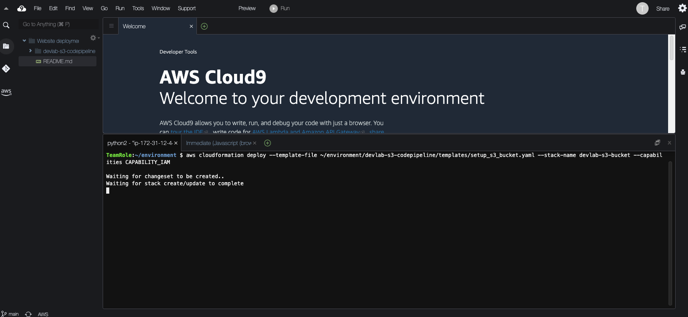


AWS CloudFormation creates the AWS resources as defined in the template, and groups them in an entity called a stack in AWS CloudFormation. You can access this stack in the [console](https://console.aws.amazon.com/cloudformation). Click on the stack name **devlab-s3-bucket** (or filter by name if you stack is not listed). 


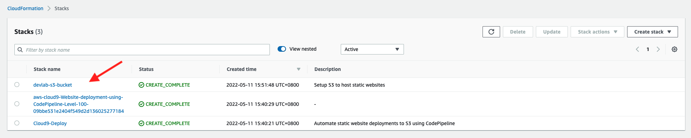

**Expand** the output section. 

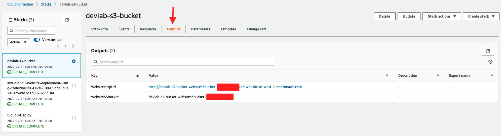


2. Copy bucket name, switch to [S3 console](https://console.aws.amazon.com/s3) and search your bucket name.

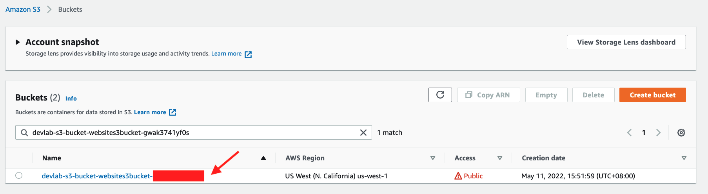


3. Click on bucket name and review Bucket policy under permissions tab. **Note** Only public read (GET) is allowed.


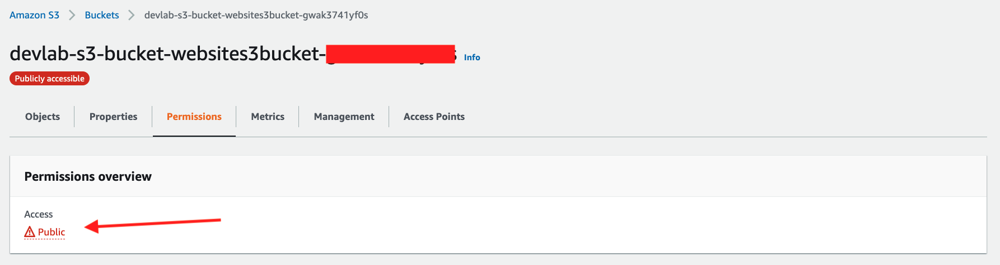


### Step 2: Upload files to S3 and access them using Website URL

1. Now you have the bucket, let us upload some files and view them in a browser. Use following command to upload files from pre-reqs folder to S3 bucket you just created. 

```bash
aws s3 cp /home/ec2-user/environment/awss3labhome/prereqs/index.html s3://<replace-by-s3-bucket-name-created-above>

aws s3 cp /home/ec2-user/environment/awss3labhome/prereqs/error.html s3://<replace-by-s3-bucket-name-created-above>
```

**Note** If you do not have the bucket name or website url, execute following command to list them.

```bash
aws cloudformation describe-stacks --stack-name 'devlab-s3-bucket' --query Stacks[*].Outputs[*]
```

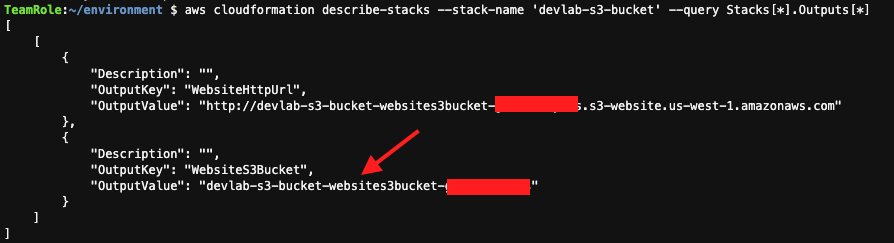

2. Finally access the website URL in a browser and you will see a hello world message (from index.html)

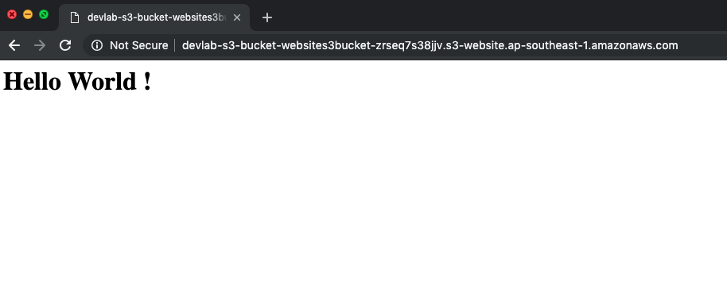


### Step 3: Add code repository and pipeline to automate deployments

1. Website works fine, however everytime every update requires you to manually upload the files to S3. Lets automate this. In the following steps, we will create a code repository and a pipeline to automate deployments to S3. 


2. Execute following command to create a code commit repository and pipeline. 

```bash
aws cloudformation deploy --template-file /home/ec2-user/environment/awss3labhome/prereqs/setup_deployment_pipeline.yaml --stack-name devlab-s3-bucket-pipeline --parameter-overrides WebsiteS3Bucket=<replace-by-s3-bucket-name-created-above> --capabilities CAPABILITY_IAM
```

**Note** WebsiteS3Bucket is the same bucket we created earlier. If you do not have the bucket name or website url, execute following command to list them.

```bash
aws cloudformation describe-stacks --stack-name 'devlab-s3-bucket' --query Stacks[*].Outputs[*]
```

You can review the stack in the cloudformation [console](https://console.aws.amazon.com/cloudformation) or execute following command to review the outputs

```bash
aws cloudformation describe-stacks --stack-name 'devlab-s3-bucket-pipeline' --query Stacks[*].Outputs[*]
```

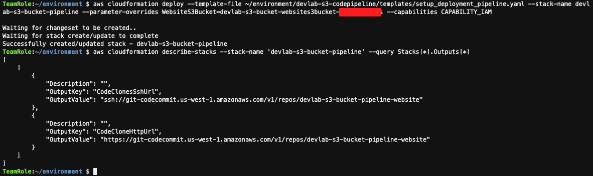


3. Now the code repository is ready, you need to [setup credentials](https://docs.aws.amazon.com/codecommit/latest/userguide/setting-up-https-unixes.html#setting-up-https-unixes-credential-helper) so we can use access it.

```bash
git config --global credential.helper '!aws codecommit credential-helper $@'
git config --global credential.UseHttpPath true
```

4. Clone the respository using http url. This will create a new folder in our workspace.

**Note** Execute following command to fetch code commit details 

```bash
aws cloudformation describe-stacks --stack-name 'devlab-s3-bucket-pipeline' --query Stacks[*].Outputs[*]
```


```bash
git clone <CodeCloneHttpUrl>
```

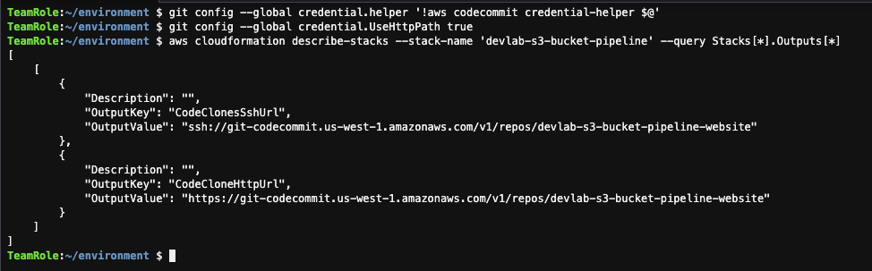


5. Use following command to move files from prereqs to our repo

```bash
cp -R /home/ec2-user/environment/awss3labhome/prereqs/*.html /home/ec2-user/environment/devlab-s3-bucket-pipeline-website/
```

6. Expand the folder to verify the files are there, and update index.html using cloud9. Use following command to commit your changes to the repository. 
   

```bash
cd /home/ec2-user/environment/devlab-s3-bucket-pipeline-website/ 
git add .
git commit -m 'first commit: updates to index.html'
git push
```

7. Access [CodePipeline](https://console.aws.amazon.com/codepipeline) through console. You will notice that pipeline has pushed your changes to s3 bucket.

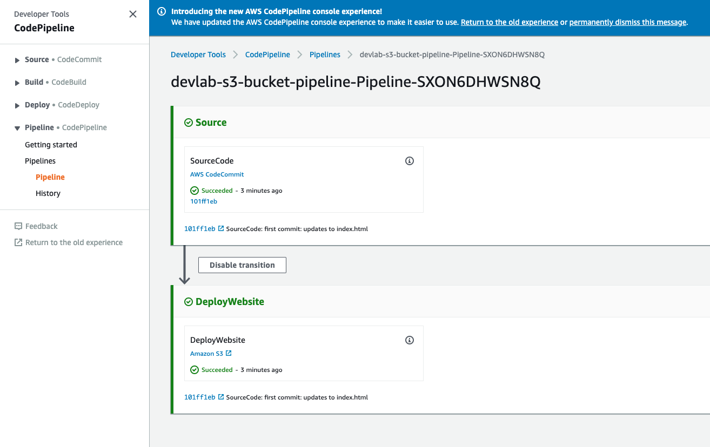

8. Visit the website url again (or refresh the page if you have it opened). You should see the updated message.

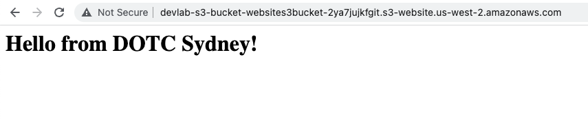


**Congratulations** You have successfully automated deployments to your S3 bucket. 


### Step 4: Review and Cleanup 

1. You have created and configured S3 bucket to host static websites, and configured a pipeline to auto deploy changes to S3. 

2. Delete S3 Stack 

```bash
aws cloudformation delete-stack --stack-name 'devlab-s3-bucket'
```

3. Delete CodePipeline Stack 

```bash
aws cloudformation delete-stack --stack-name 'devlab-s3-bucket-pipeline'
```

4. Close all terminal and delete your project

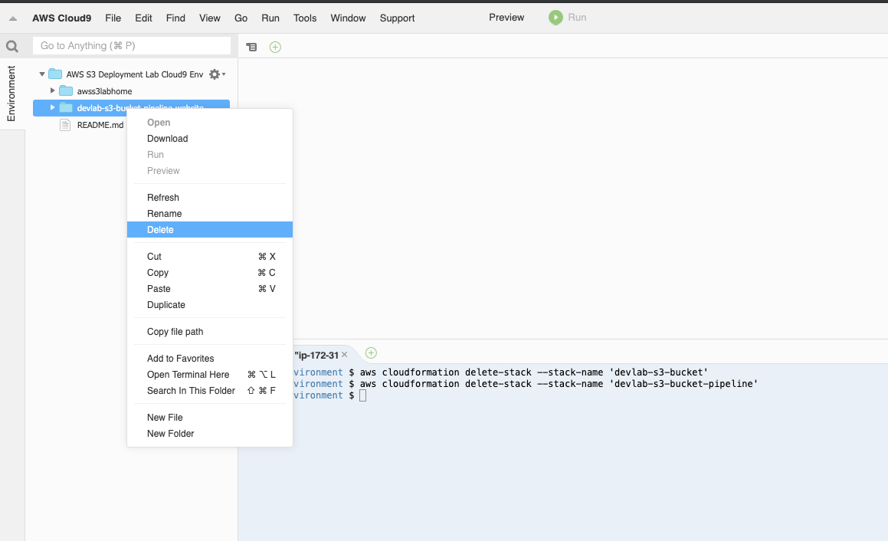


